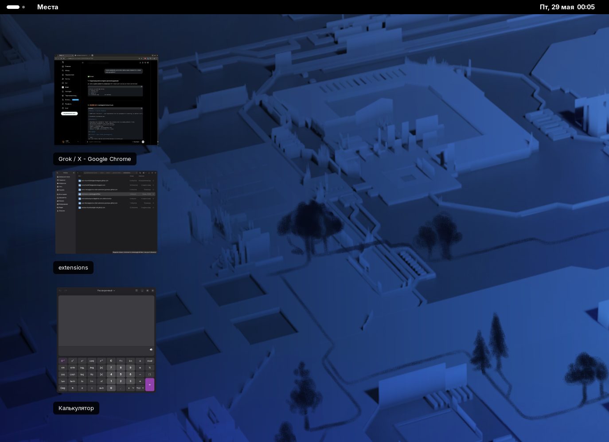

# Minimize to Desktop Thumbnail

**GNOME Shell Extension** — при сворачивании окна оно превращается в миниатюру на рабочем столе (как обычные файлы).



## Возможности

- Миниатюры окон появляются на уровне рабочего стола
- Вертикальное размещение (как иконки файлов)
- Фиксированная ширина с сохранением пропорций
- Подпись с названием окна
- Клик по миниатюре — восстановление окна
- Работает на GNOME 46–50 (Fedora 44 и новее)

## Установка

### Способ 1: Через GitHub (рекомендуется)

```bash
git clone https://github.com/LiteTabs/minimize-to-desktop.git
cd minimize-to-desktop
mkdir -p ~/.local/share/gnome-shell/extensions/minimize-to-desktop@LiteTabs
cp -r * ~/.local/share/gnome-shell/extensions/minimize-to-desktop@LiteTabs/
